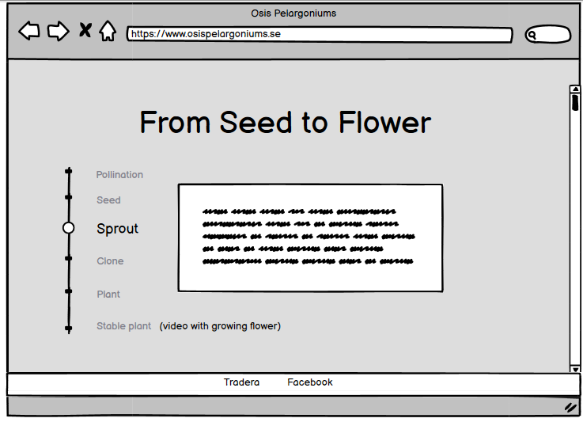

# Osis pelargoniums
## Introduction
The site is made with the purpose to invoke interest for Osis Pelargoniums and give the user a basic introduction of the processing of pelargoniums. The target audience of the site is a person with an interest in pelargoniums that may have visited Osis social media and wants to see and learn more about the different sorts. You can think of this site as a showroom, it is only intended to show of the flowers and sales will be handled on other channels.
## UX/Design
This section contains details of the sites design
#### Color scheme
- The colors of the site is blue (#7592A0ff) and pink (#E4B9B2ff), these colors was chosen because they go well with the hero-image.

#### Typography
- For headings the font ‘Dancing Script’ is used and ‘Josefin Sans’ is used for the body, ‘Josefin Sans’ has fallback ‘Sans-Serif’ and ‘Dancing Script’ has ‘Cursive’. This pair was chosen after reading the [article](https://govisually.com/blog/2020s-top-20-google-font-pairs-for-your-next-project/). The typography is modern without feeling stiff which goes well with the rest of the content.
#### Borders
- Horizontal and vertical borders are used as a part of the sites design, the borders use the same color-scheme as the rest of the site. The borders are used to make large single-colored sections a bit more lively.
#### Wireframes
This is the wireframes for large screens. The layout of the photo wall was created but changed through the project because it did not match the expectations. 

This is the wireframes for small screens.

This is a more detailed wireframe of the timeline. 

The medium sized screen has few differences from large and small, it's a mix of them. Therefore, no wireframes are provided. The only difference is how the grid system and columns are shown. 

## Features
This section will describe all sections, their features and intended purpose. The section begins with features common for all site pages.
#### Navigation bar
- In the navbar we find link to all other pages on the site: Home, Our Pelargoniums and Contact. The navbar is quite discrete, it is as visible as needed while remaining as functional as could be.

- It is fully responsive and changes appearance based on the user’s screen size. On smaller devices the navbar is minimized and the user needs to open it to see all links.

#### Hero image
- The hero-image is chosen to give the user a summer feeling, the time of the year when flowers are in bloom.  Attentive users will later learn that the image has more meaning, as one of the flowers is call ‘Rosa himmel’ (Swedish for pink sky).

#### Footer
- A clean footer with links to Osis Pelargoniums social medias.

### Home page
This page has three sections: introduction, photo wall and timeline.
#### Introduction
- This section gives the user a short story of how Osis started.
#### Photo wall
- This section’s purpose is to show some of the sort available at Osis. The photo wall contains pictures of flowers from other processors as well as Osis own. This is to show some of the flowers used in the processing.

- The responsive design is built up on columns. On larger screens we will see three columns, on medium sized screens (768px wide and down) we will see two and for smaller screens (481px and down) we will see one column.

- When hoovering an image, the flowers name will be visible. This is to make it easy for the user to seek information about flowers from other processors elsewhere, since this site only contains information about Osis own flowers.

#### Timeline
- The timeline section is intended to give the user an easygoing introduction to pelargonium processing and to motivate them to try themselves.

- It is constructed with radio-buttons, but with the button itself hidden as this is a cleaner look. To only show the selected processing step pseudo classes is used to hide all steps but the selected.

- On step five of the timeline an audio-element is used to celebrate completion of all steps in a fun way.

### Our pelargoniums
This page contains two sections: Introduction and Our Pelargoniums. Here we can see all of the flowers the processor has today. The user can also read more information about their flower of interest.
#### Introduction
- A short background story to why Osis decided to start with pelargonium processing.
#### Our pelargoniums
- This section is intended to showcase the processors own flowers. There is also more information about the flowers then they would have on social media which is more picture centric.

- The page is fully responsive and with the current number of cards (image and text) the grid system will be a 2x3 on larger screens and 1x6 on smaller screens. Each flower has its own card.

### Contact
On the contact page the user can get in touch with Osis. The contact form has a clean and intuitive design and contains textbox with well visible labels for name, e-mail and textbox for free text.

### 404
If the user navigates to a non-existing url, the user is redirected to a 404 page.

## Test and validation
Read more about test and validation [here](TEST.md)
## Bugs corrections and improvements
This section contains details of the sites bugs corrections and future improvements.
#### Unfixed bugs
- The navbar has a non-functional bug, its look and function is as intended. Bootstrap includes functionality for having a navbar-brand and the minimalistic design decision made a brand unwanted. However, this div has not been possible to remove as it changes the overall appearance of the navbar.
Since this is non-functional it was decided to leave as is and focus on more important improvements.
#### Future improvements 
- On the Our Pelargoniums-page, include a link that leads to a page with more information about the flowers such as: how does it grow, rooting and more information about parents.

- Sales is handled in other channels today and in the future functionality for handling this on the site would be nice.
## Deployment
This section describes how the site was deployed. 

1. Make sure that all code is comitted and pushed. 
2. Go to GitHub. Choose which repository to deploy.
3. Go to 'Settings', scroll to GitHub Pages and click 'Check it out here'.
4. In section source, select main branch and save. 
5. Wait until GitHub has created your link to the deployed site.
## Credits
This section describes things used for building this website. Special thanks to my mentor Reuben Ferrante for great support. 
#### Code
[Bootstrap](https://getbootstrap.com/): Used for the navbar and also for icon in timeline.

[Dev.to css hack](https://dev.to/devhammed/awesome-checkbox-and-radio-button-css-hacks-1b75): Used as inspiration when creating the radio-buttons in the Timeline.

[w3scools image overlay](https://www.w3schools.com/howto/howto_css_image_overlay_title.asp): Used as a guide for creating the flower-name-image-overlay.

[w3schools grid](https://www.w3schools.com/css/css_grid.asp): Used as guide when creating grid system on section Our Pelargoniums.
#### Content and media
[Font awesome](https://fontawesome.com/): Icons used in timeline section.

[Freesound](https://freesound.org/): Audio from freesound used in step five of timeline.

[Favicon](https://favicon.io/favicon-generator/): Used for creating favicon image.

[Google fonts](https://fonts.google.com/): Fonts used in headers and body text.

[Pexels](https://www.pexels.com/sv-se/): The picture in the hero-image is from Pexels.

[Youtube](https://youtu.be/8K2auUWtN1U): The video on page Our Pelargoniums is from YouTube.
#### Tools
[Color matcher](https://coolors.co/image-picker): To get colors that goes well with the hero-image an external tool was used, this tool lets the user select color from image and is presented with a palette of matching colors.

[Compressjpeg](https://compressjpeg.com/): Used for compressing images.

[Converter Px to REM](https://nekocalc.com/px-to-rem-converter): Used for convert Px to rem 

[Reqtest](https://reqtest.com/testing-blog/how-to-write-effective-test-cases/): Used as guide for writing test cases. 

